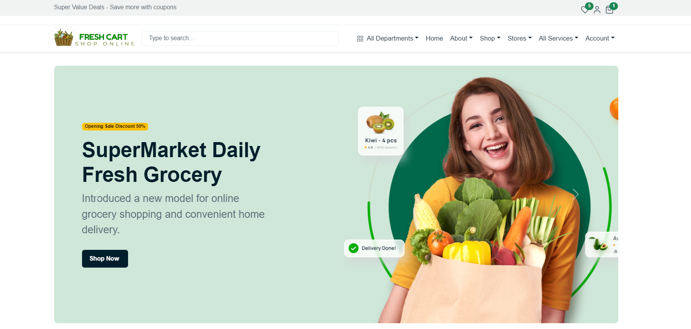
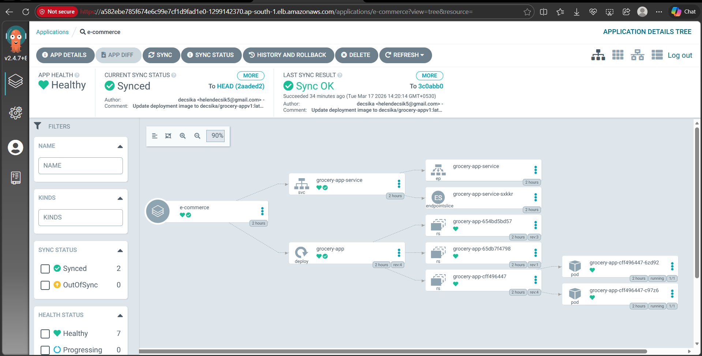
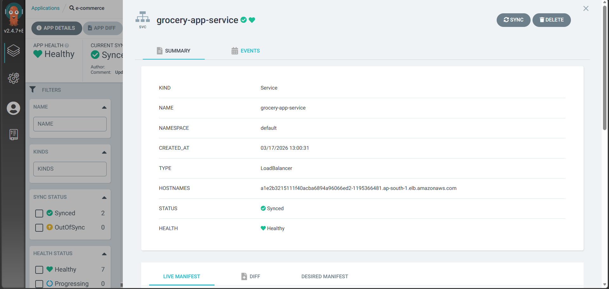
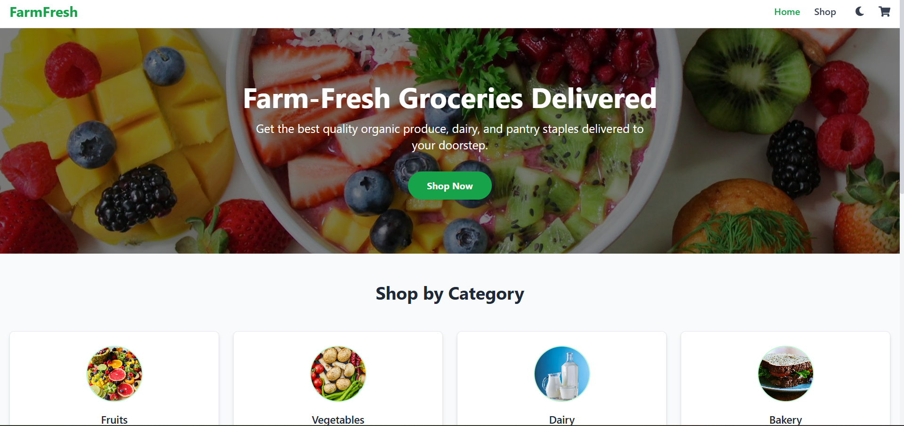

# Production-Grade-DevSecOps-CI-CD-Pipeline
 This project demonstrates an end-to-end DevSecOps pipeline for deploying a secure E-commerce application using CI/CD, containerization, and Kubernetes on AWS.

## Features 
- Automated CI/CD pipeline using Jenkins
- Infrastructure creation using Terraform
- Docker containerization
- Security scanning (Trivy, OWASP)
- Code quality check using SonarQube
- GitOps deployment using ArgoCD
- Kubernetes deployment on AWS EKS
- Fully automated build → scan → deploy flow

## Architecture Diagram


## Technologies used
- AWS (EKS, EC2, IAM)
- Terraform
- Jenkins
- Docker
- Kubernetes
- ArgoCD
- SonarQube
- Trivy (Image Scan)
- OWASP Dependency Check
- GitHub

## Folder Structure
## 📁 Folder Structure

```text
Decsika-tech/
├── EKS_TERRAFORM/   #Terraform files for provisioning the Amazon EKS cluster and worker nodes.
│   ├── backend.tf
│   ├── main.tf
│   └── provider.tf
│
├── Jenkins-CICD/    #Jenkins pipeline, Terraform files, website files, and deployment scripts.
│   ├── Jenkinsfile
│   ├── backend.tf
│   ├── main.tf
│   ├── outputs.tf
│   ├── provider.tf
│   ├── s3.tf
│   ├── variables.tf
│   ├── website.sh
│   ├── index.html
│   ├── error.html
│   ├── script.js
│   └── style.css
│
├── public/           #Static assets used by the application.
│   ├── favicon.ico
│   ├── index.html
│   ├── logo192.png
│   ├── logo512.png
│   ├── manifest.json
│   └── robots.txt
│
├── src/
│   ├── components/   #React application source code and components.
│   │   ├── CartModal.jsx
│   │   ├── CategoryCard.jsx
│   │   ├── Footer.jsx
│   │   ├── Header.jsx
│   │   ├── MobileMenu.jsx
│   │   ├── ProductCard.jsx
│   │   ├── ProductModal.jsx
│   │   ├── ScrollToTop.jsx
│   │   └── ThemeToggle.jsx
│   │
│   ├── context/      
│   │   ├── CartContext.jsx
│   │   └── ThemeContext.jsx
│   │
│   ├── data/
│   │   └── products.js
│   │
│   ├── pages/
│   │   ├── Home.jsx
│   │   ├── Shop.jsx
│   │   └── NotFound.jsx
│   │
│   ├── styles/
│   │   └── index.css
│   │
│   ├── App.jsx
│   ├── App.test.js
│   ├── index.jsx
│   ├── logo.svg
│   ├── reportWebVitals.js
│   └── setupTests.js
│
├── Dockerfile       #Docker configuration for building the application image.
├── deployment-service.yml   #Kubernetes Deployment and Service manifests.
├── package.json
├── package-lock.json
├── vite.config.js
├── tailwind.config.js
├── postcss.config.js
├── eslint.config.js
├── .gitignore
├── about
```

## How to Run the Project
Follow these steps to run the project.

### Step 1: Clone the Repository

```bash
git clone https://github.com/Decsika-tech/Production-Grade-DevSecOps-CI-CD-Pipeline.git
```
### Step 2: Create an AWS EC2 Instance in AWS console
- Launch an Ubuntu 24 EC2 instance (t2.large or m7i-flex.large).
- Allocate 50 GB storage.
- Attach an IAM role with Administrator access.
  
### Step 3: Connect to the EC2 Instance

```bash
ssh -i <key.pem> ubuntu@<ec2-public-ip>
sudo -s
hostnamectl set-hostname grocery
sudo -i
```

### Step 4: Install Required Tools
Install the following tools on the EC2 instance:
-Jenkins
- Docker
- Java
- trivy
- SonarQube 
- AWS CLI
- kubectl
- Terraform

### 4. Create the EKS Cluster
- Configure Terraform.
- Create the Amazon EKS cluster and worker nodes.

### 5. Configure Jenkins
Create two Jenkins pipeline jobs:
1. EKS Provisioning Job
2. Grocery Application Deployment Job

Install the required Jenkins plugins:
- SonarQube Scanner
- NodeJS
- OWASP Dependency Check
- Docker Plugins
- Kubernetes Plugins

### 6. Configure Integrations
- Connect SonarQube to Jenkins.
- Add Docker Hub credentials.
- Add GitHub token.
- Configure Kubernetes credentials.

### 7. Run the CI/CD Pipeline
Push the application code to GitHub. Jenkins automatically:
- Performs code quality analysis using SonarQube
- Installs dependencies (`npm install`)
- Runs security scans (OWASP and Trivy)
- Builds the Docker image
- Pushes the image to Docker Hub
- Updates Kubernetes manifests in GitHub

### 8. Deploy with ArgoCD
- Install ArgoCD on Amazon EKS.
- Connect the Kubernetes manifest repository.
- Enable automatic synchronization.

### 9. Monitor the Application
- Install Prometheus to collect metrics from the EKS cluster and application.
- Configure Grafana dashboards to visualize metrics and monitor application health.

### 10. Access the Application
ArgoCD deploys the application to Amazon EKS automatically. Open the LoadBalancer URL in your browser to access the application.

## Screenshot
### Grocery website version-1 


### ArgoCD triggered after manifest file update



### Grocery website version-2


## Contributing
Pull requests are welcome! If you find any issues, feel free to open an issue.

## Contact
For any queries, reach out at helendecsika5@gmail.com.
