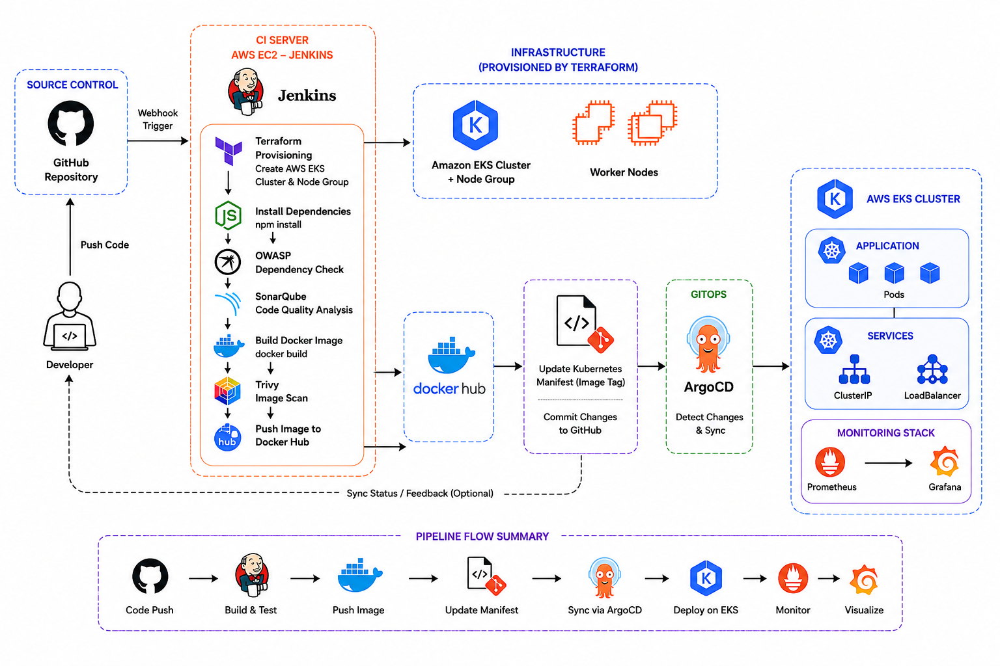

# Production-Grade-DevSecOps-CI-CD-Pipeline
 This project demonstrates an end-to-end DevSecOps pipeline for deploying a secure E-commerce application using CI/CD, containerization, and Kubernetes on AWS.

## Features 
- Automated CI/CD pipeline using Jenkins
- Infrastructure creation using Terraform
- Docker containerization
- Security scanning (Trivy, OWASP)
- Code quality check using SonarQube
- GitOps deployment using ArgoCD
- Kubernetes deployment on AWS EKS
- Fully automated build → scan → deploy flow

## Architecture Diagram

## Technologies used
- AWS (EKS, EC2, IAM)
- Terraform
- Jenkins
- Docker
- Kubernetes
- ArgoCD
- SonarQube
- Trivy (Image Scan)
- OWASP Dependency Check
- GitHub

## Folder Structure

## How to Run the Project

## Screenshot

## Contributing
Pull requests are welcome! If you find any issues, feel free to open an issue.

## Contact
For any queries, reach out at helendecsika5@gmail.com.
